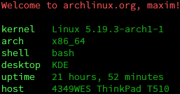

# browskyfetch

Simple system information script written in bash. Mostly done but I might add more features later.

(also will probably change the name)

### Information:

- Username and OS url
- Kernel name and version
- System architecture
- Default shell
- Desktop environment
- Uptime
- Host machine name

